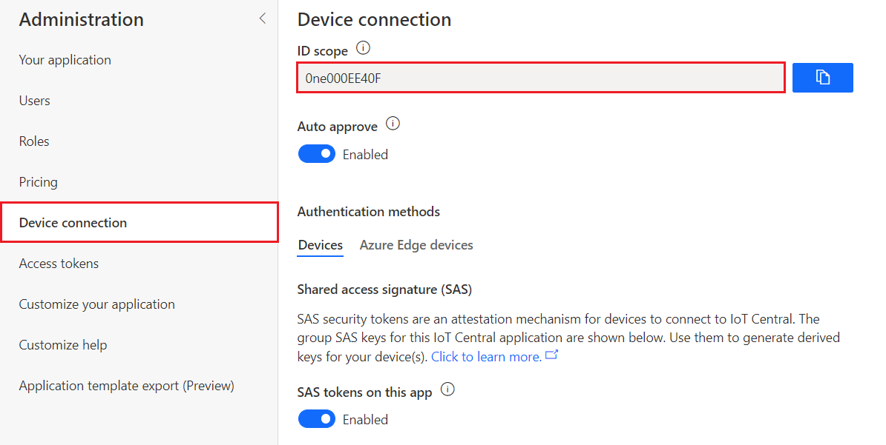
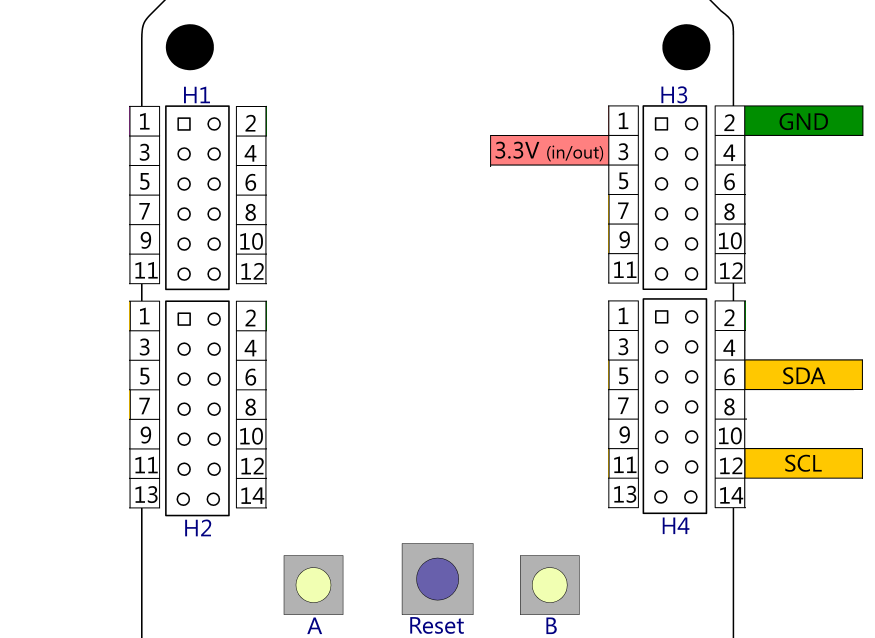
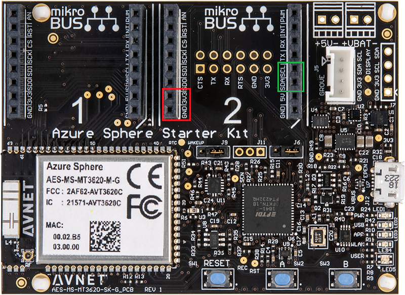
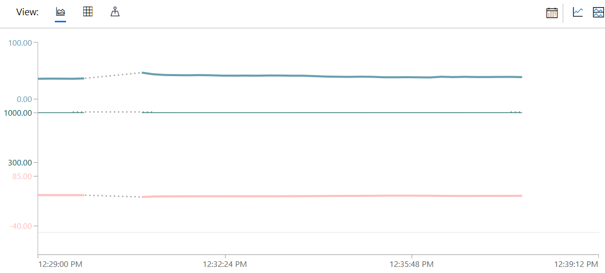

# Lab-4: Visualize real world data on Azure IoT Central

- Go to [Home Page](README.md)

## Goals

- Hands-on with Azure IoT Central configuration
- Understand the basic feature of IoT Central offered as a IoT SaaS solution
- Get familiar with I2C API to connect to external sensor device
- Use Azure Sphere and Azure IoT Central work together to build a secured end-to-end solution with telemtery collection, visulization and remote control ability.

## Steps

1. After connect Azure Sphere development board to your PC, enable device debug and disable OTA in Azure Sphere utility by:
   
   `azsphere device enable-development`

2. Make sure WiFi credential is configured and Azure Sphere is connected to AP. If Lab-2 and Lab-3 are skipped, follow Step 1) and 2) in [Ove-The-Air upgrade](Lab-2.md) to setup.
   
3. Follow [Setup IoT Central](https://docs.microsoft.com/en-us/azure-sphere/app-development/setup-iot-central) page to setup cloud resources, the key steps are:
    
    - Create Azure IoT Central Application
    - Upload tenant CA certificate to IoT Central and finish Proof of Procession

4. Go to your application in [Azure IoT Central](https://apps.azureiotcentral.com/) and click **Create Device Templates** on the home page, select **Custom** to start a blank template. Give a name to your template and click **Create** button. 

    

    > Select P
   
5. Click **+ New** button and select **Telemetry**
   
   1. Set the Display Name and Field Name to **Temperature**. The Field Name must exactly match the name in the sample code, so this value is case-sensitive. Set Units to Degrees, and set the Minimum Value and Maximum Value to -40 and 85, respectively. Then click Save.

   2. Set one more telemetry **Humidity**, set range and unit to 0% to 100%
   3. Set one more telemetry **Pressure**, set range and unit to 300 to 1100 hPa

6. Click **+ New** button and select **Event**, Set the Display Name and Field Name to **ButtonPress**. Then click Save. 

    

7. On the left Side Navigation select **Devices**, click + to add a new device, and select **Real** from the drop-down menu. A dialog will prompt to ask for Device ID and Name.

    

8. In an Azure Sphere Developer Command Prompt, type the following command:
   
   `powershell -Command ((azsphere device show-attached)[0] -split ': ')[1].ToLower()`

   Copy the lowercase device ID and paste it into the Device ID field of the Create New Device dialog box. Device name will be changed automatically using the device ID appended. Click **Create** button.

3. Open AzureIoT project in *.\azure-sphere-samples\Samples\AzureIoT* folder. If you're using **AVNET_MT3620_SK** board, follow Step 4 in [Lab-1](Lab-1.md) to modify hardware definition file first.
   
4. Before build the project, there're three key information you need provide to the applicaton in app_manifest.json file.  
   
   - The Tenant ID for your Azure Sphere device
   - The Scope ID for your Azure IoT Central application
   - The IoT hub URL for your Azure IoT Central application 

    **Tenant ID** can be retrieve from Azure Sphere command line utility by
    `azsphere tenant show-selected`

    

    **Scoep ID** can be found in the Administration/Device connection page of IoT Central

    

    To get **IoT Hub URL**, there is a assist tool in *.\azure-sphere-samples\Samples\AzureIoT\Tools* folder can help. In Azure Sphere command line utility, go to above location, and run `ShowIoTCentralConfig.exe`, input 'n' and provide below information, the tool will output the IoT Hub URL.

    1. Scope ID
    2. SAS Primary key (click view keys on above page)
    3. device ID

    

    Fill these information in app_manifest.json file as below:

    

10. If you're using **MT3620_RDB**, connect BME280 sensor board to I2C pins of ISU2 on H4. GND and 3V3 can be provided via H3.

    

11. If you're using **AVNET_MT3620_SK**, connect BME280 sensor board to I2C pins of ISU2 on MikoBUS header as below picture shows. 

    


12. Grant ISU2 I2C access permission to applicaiton in app_manifest.json.
    
    

13. By default the Azure IoT sample project send simulated temperature sensor data to Azure IoT. Hack the code to visualize your real world data! 

    > BME280 driver is provided in Code/Lab-4 folder. There're only two API exposed in bme280_uesr.h will be needed by your application. 
    
    ```
    int bme280_component_config (int isu_port);
    int bme280_component_getdata(struct bme280_data* pData);
    ```

    > Need update CMakeLists.txt file to add bme280_driver.c and bme280_driver.c to the ADD_EXECUTABLE before build.

14. After code hack, select **GDB Debugger (HLCore)** and Press F5 to build and run the applicaiton. Go to the device dashboard to check your data.

    

## Read more

- [What is Azure IoT Central](https://docs.microsoft.com/en-us/azure/iot-central/overview-iot-central)
- [Azure IoT Central Architecture](https://docs.microsoft.com/en-us/azure/iot-central/concepts-architecture)
- [Use I2C with Azure Sphere](https://docs.microsoft.com/en-us/azure-sphere/app-development/i2c)
- [Manage target hardware dependencies](https://docs.microsoft.com/en-us/azure-sphere/app-development/manage-hardware-dependencies)


