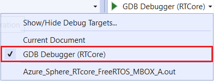

# Lab-5: Real-time core Application Programming

- Go to [Home Page](README.md)

## Goals

- Understand the basic element of Azure Sphere Real-time Application
- Get familiar with inter-core communication API
- Learn how to use basic GPIO API from Mediatek M4 driver library

## Steps

1. Enable real-time core device debug by openning Azure Sphere utility as Administrator.
   
   `azsphere device enable-development --enablertcoredebugging`

2. Clone Microsoft official Azure Sphere Samples repo.

    `git clone https://github.com/Azure/azure-sphere-samples`

3. Clone Mediatek MT3620 M4 driver & sample code repo to root folder of a disk.

    `https://github.com/MediaTek-Labs/mt3620_m4_software`

4. To support FreeRTOS for Cortex-M4F arch, you need copy *.\mt3620_m4_software\MT3620_M4_Sample_Code\FreeRTOS\MT3620_RTApp_FreeRTOS_MBOX\RTAppA\AzureSphereRTCoreToolchainVFP.cmake* to the Azure Sphere SDK install folder. (Default path is C:\Program Files (x86)\Microsoft Azure Sphere SDK\CMakeFiles)

5. Open Visual Studio, select **Open a local folder** in Visual Studio and navigate to *.\azure-sphere-samples\Samples\IntercoreComms_HighLevelApp\IntercoreComms_HighLevelApp*, click **Select Folder** to open the CMake project.

    > This project is a demo to show how to do inter-core communication on High-level application. It sends a message to Real-time core every 1 second. and wait for feedback. 

6. Open another Visual Studio instance, select **Open a local folder** and then navigate to *.\mt3620_m4_software\MT3620_M4_Sample_Code\FreeRTOS\MT3620_RTApp_FreeRTOS_MBOX\RTAppA*, click **Select Folder** to open the CMake project.

    > This project is a demo to show how to do inter-core communication on real-time application. It waits for a message from High-level core and send response back. 

7. In **real-time application** project, do the following changes to add GPIO driver and code block to toggle LED every time real-time receives a message from high-level core. 

    1. #include `"os_hal_gpio.h"`
    2. Add a helper function to toggle RED led
        
        ```
        int gpio_toggle(u8 gpio_no)
        {
            static u8 level = 0;
            int ret;

            ret = mtk_os_hal_gpio_request(gpio_no);
            if (ret != 0) {
                printf("request gpio[%d] fail\n", gpio_no);
                return ret;
            }
            mtk_os_hal_gpio_set_direction(gpio_no, OS_HAL_GPIO_DIR_OUTPUT);
            mtk_os_hal_gpio_set_output(gpio_no, level);
            level = !level;
            ret = mtk_os_hal_gpio_free(gpio_no);
            if (ret != 0) {
                printf("free gpio[%d] fail\n", gpio_no);
                return ret;
            }
            return 0;
        }
        ```

    3. Add a function call `gpio_toggle(OS_HAL_GPIO_8);` after `mbox_print_buf(mbox_buf, mbox_buf_len);` in main body of MBOXTask_A.
   
    4. In `app_manifest.json`, add red LED (GPIO8) **Gpio** to **Capabilities** section to authorize real-time application to use this GPIO. 

        ```
        "Capabilities": {
            "Uart": [ "ISU0" ],
            "AllowedApplicationConnections": [ "25025D2C-66DA-4448-BAE1-AC26FCDD3627" ],
            "Gpio": [ 8 ]
        },
        ```

    5. Copy **ComponentId** field, it will be used later in high-level application.

8.  Select **GDB Debugger (RTCore)** as debug target and press **F5** to start build and load target real-time application onto device. The real-time application has no actions but just wait message from high-level application.
   
    

9. In **high-level application** project, do the following changes to trust and partner with above real-time application
    
    1. In **main.c**, override the value of **rtAppComponentId** array to the copied real-time application component id. (arround line 49). This value is used to create application socket to talk to a speicific application running on rt core. 

    2. In **app_manifest.json**, override the value of **AllowedApplicationConnections** item to the copied real-time application component id. This gives high-level application proper access right.

    3. In **launch.vs.json**, override the value of **partnerComponents** item to the copied real-time application component id. This prevents visual studio to remove loaded app running rt core as a [parnter application]([partnerComponents](https://docs.microsoft.com/en-us/azure-sphere/app-development/applications-overview#partner-applications))

10. Select **GDB Debugger (HLCore)** as debug target and press **F5** to start build and load target high-level application onto device. 
   
    

11. You will see red LED start to blink every seconds after high-level application is loaded. Also logs can be observed from output window in high-level application.

    ```
    Remote debugging from host 192.168.35.1, port 64451
    High-level intercore application.
    Sends data to, and receives data from the real-time core.
    Sending: Hello-World-0
    Received 13 bytes: hELLO-wORLD-0
    Sending: Hello-World-1
    Received 13 bytes: hELLO-wORLD-1
    Sending: Hello-World-2
    Received 13 bytes: hELLO-wORLD-2
    Sending: Hello-World-3
    Received 13 bytes: hELLO-wORLD-3
    Sending: Hello-World-4
    Received 13 bytes: hELLO-wORLD-4
    Sending: Hello-World-5
    Received 13 bytes: hELLO-wORLD-5
    ...
    ```

## Read more
- [Communicate with a real-time capable application](https://docs.microsoft.com/en-us/azure-sphere/app-development/high-level-inter-app)
- [Overview of real-time capable application development](https://docs.microsoft.com/en-us/azure-sphere/app-development/rt-app-development-overview)
- [CodeThink MT3620 drivers](https://github.com/CodethinkLabs/mt3620-m4-drivers)

