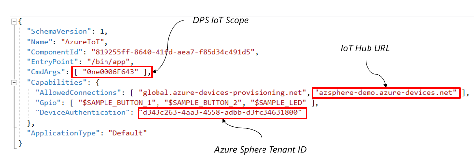
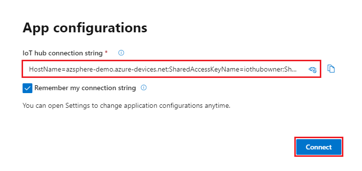
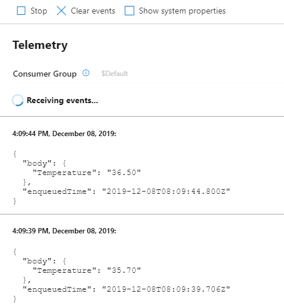
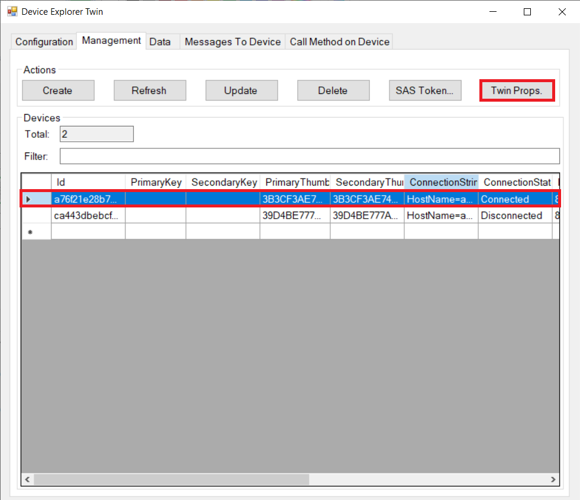
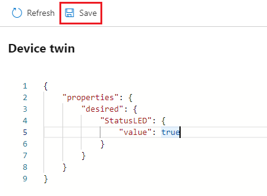
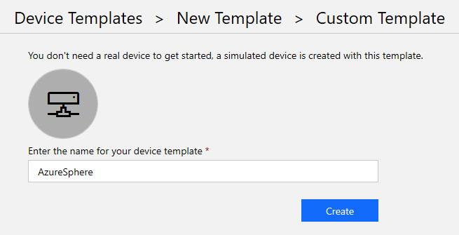
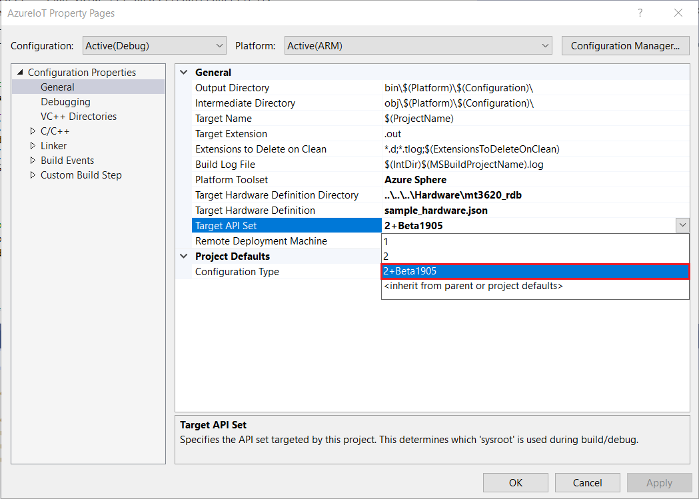

# Azure-Sphere-Bootcamp

This repo is built for Azure Sphere Bootcamp Hands-on day. It provides all required information for trainee to follow and finish all hands-on labs. 

# Pre-Lab prerequisites

Follow [Install Azure Sphere](https://docs.microsoft.com/en-us/azure-sphere/install/overview) section to complete all neccessary steps before start. 

Quick check list:
- FTDI driver is installed and three COMx ports are present in Device Manager 
- Up to date Visual Studio and Azure Sphere SDK are installed
- Has registered a Azure account and a free subscription or pay-as-you-go subscription
- Has logged in Azure Sphere command line utility by `azsphere login`
- (New orgnization ONLY) Create a Azure Sphere tenant by `azsphere tenant create -n <tenant name>`
- Has selected Azure Sphere tenant by `azsphere tenant select -i <tenant id>`
- (New device ONLY) Device is claimed to user's tenant by `azsphere device claim`
- Device is recovered by `azsphere device recover` command to have a knowning good Azure Sphere OS.

# Lab-1: Blinking LED

## Goals

- Understand the basic sketch of Azure Sphere High-level Applicaiton
- Leann how to build & debug Application using Visual Studio
- Learn how to use GPIO API from Azure Sphere SDK

## Steps

1. Enable device debug and disable OTA in Azure Sphere utility
   
   `azsphere device prep-debug`

2. Clone Azure Sphere Samples repo

    `git clone https://github.com/Azure/azure-sphere-samples`

3. Open a project or solution in Visual Studio and navigate to the folder of *.\azure-sphere-samples\Samples\GPIO\GPIO_HighLevelApp*, open GPIO_HighLevelApp.sln and press **F5** to build and load the application onto the device for debugging.
   
 
   
4. LED1 start to blink after Application is loaded. Press **Button A** will change the blinking rate. Both LED1 and Button A are connected to GPIO pin and controlled by the high-level Application.

5. Select Line 74 and press **F9** to set a breakpoint on function *GPIO_SetValue*, you will see the program is halt and stop on this line. Continue with **F5** and now you can control the ON/OFF state of LED.

 

## Read more
- [Using GPIOs on Azure Sphere](https://docs.microsoft.com/en-us/azure-sphere/app-development/gpio)
- [Best practices for high-level Application](https://docs.microsoft.com/en-us/azure-sphere/app-development/initialization-termination)
- [Manage target hardware dependencies](https://docs.microsoft.com/en-us/azure-sphere/app-development/manage-hardware-dependencies)

# Lab-2: Application Over-the-Air deployment

## Goals

- Learn how to configure WiFi network for Azure Sphere
- Learn how to use Azure Sphere utility to deploy an application Over-the-Air
- Understand all the concepts in Over-The-Air deployment
  
## Steps 

1. Configure the WiFi SSID and Password and allow Azure Sphere to connect Azure Sphere Security Service.
   
   `azsphere device wifi add --ssid <yourSSID> --key <yourNetworkKey>`
   
   > - To add an open network, omit the --key flag
   > - If your network SSID or key has embedded spaces, enclose in quotation marks, e.g. --ssid "My iPhone"

2. Check WiFi status and confirm it is connnected to the AP.
   
   `azsphere device wifi show-status`

    
    
3. Create a *product SKU* and assign an unique name, record the GUID for later use. The description parameter is optional. 

   `azsphere sku create --name <sku-name> --description <optional-desc>`
   
4. Create a *device group* and assign an unique name, record the GUID for later use. This device group has a default policy that will accept all updates from the Azure Sphere Security Service (Both OS and App)

    `azsphere device-group create --name <device-group-name>`

5. Attach SKU to the device and assign the device to the device group. In the meantime, the following command will delete existing applications and disable debug capability. Now device only accept production-siged image from Azure Sphere Security Service (aka AS3). 

    `azsphere device prep-field --skuid <productsku-GUID> --devicegroupid <devgroup-GUID>`

    At this point, you will see previous loaded LED blink application is not working. 

6. Running command `azsphere device show-ota-config` will get the device related information on AS3, record the *chip SKU* for later use.

   

7. Upload your application to AS3 and automatically create the component that represent your application:
   
   `azsphere component image add --autocreatecomponent --filepath <file_path>`

   The component ID and name are retreived from the *app_manifest.json* file, since the imagepackage already have this metadata. You can also specifiy a name and a GUID for a component using `azsphere component create`, just make sure it should be consistent with the value in manifest.

    

   Write down the image ID for next-step use. This ID represent your current version of application, it changes for each build. 

    

8. Create a image set link to the image uploaded to AS3. Fill the image GUID found in previous step. The image set name must be unique in current tenant.

    `azsphere image-set create --name <imageset-name> --imageid <image-GUID>`

    > It is a good practice to use current time and data as ending of image-set name, such as ImageSet-GPIOHighLevelApp-2019.08.27.12.00

    Record the image-set GUID for Step. 10 use.
    

9. Create an application feed target to the SKU set (chip SKU + product SKU) and component identified in prevous steps. 

    `azsphere feed create --name <feed-name> --componentid <component-id> --chipSkuid <chipsku-GUID> --productskuid <productsku-GUID> --dependentfeedid 3369f0e1-dedf-49ec-a602-2aa98669fd61`

    parameter --dependentfeedid specifies the ID of the Azure Sphere OS feed (3369f0e1-dedf-49ec-a602-2aa98669fd61). All application feed must have this dependence.

    Write down the feed GUID for the last two steps.

    

10. Add the feed to the device group.
    
    `azsphere device-group feed add --devicegroupid <devgroup-GUID> --feedid <feed-GUID>`

11. Add the image set to feed to active a deployment. 

    `azsphere feed image-set add --feedid <feed-GUID> --imagesetid <imageset-GUID>`

12. Reset the board and wait few minitues, LED1 will start to blink once depolyment is finished.

13. Once a feed is active, deploy a new image is pretty straightforward. Try to modify your application and run below command, see what happens to your board!

    `azsphere component publish --feedid <feed-GUID> --imagepath <file-path>`

## Read more
- [Azure Sphere OS networking requirements](https://docs.microsoft.com/en-us/azure-sphere/network/ports-protocols-domains)
- [Deloyment basics](https://docs.microsoft.com/en-us/azure-sphere/deployment/deployment-concepts)
- [Link the device to a feed](https://docs.microsoft.com/en-us/azure-sphere/deployment/link-to-feed)
- [Set up a device group for OS evaluation](https://docs.microsoft.com/en-us/azure-sphere/deployment/set-up-evaluation-device-group)

# Lab-3: Connect to Azure IoT Hub

## Goals

- Hands-on with Azure IoT Hub configuration
- Understand how will IoT Hub DPS provision Azure Sphere device
- Understand Azure IoT Hub Device to Cloud message and Device Twin
- Get familiar with the basics of Azure IoT C device SDK API

## Steps

1. Follow [Setup IoT Hub](https://docs.microsoft.com/en-us/azure-sphere/app-development/setup-iot-hub) page to setup cloud resources, the key steps are:
    
    - Create Azure IoT Hub and DPS and link them
    - Upload tenant CA certificate to DPS and finish Proof of Procession
    - Add a enrollment group in DPS to provision Azure Sphere devices

> Azure IoT Hub DPS service do not allow to use free subscription, You should use a pay-as-you-go subscription for this lab. 

1. After connect Azure Sphere development board to your PC, enable device debug and disable OTA in Azure Sphere utility by:
   
   `azsphere device prep-debug`

2. Make sure WiFi credential is configured and Azure Sphere is connected to AP. If Lab-2 is skipped, follow Step 1) and 2) in [Ove-The-Air upgrade](#-Lab-2:-Over-the-Air-upgrade) to setup.

3. Open a solution in Visual Studio and navigate to the folder of *.\azure-sphere-samples\Samples\AzureIoT*, open AzureIoT.sln solution file. Before build the project, there're three key information you need provide to the applicaton in app_manifest.json file.
   
   1. The Tenant ID for your Azure Sphere device
   2. The Scope ID for your device provisioning service (DPS) instance
   3. The Azure IoT Hub URL for your IoT hub
   
   
   
   This [link](https://github.com/Azure/azure-sphere-samples/blob/master/Samples/AzureIoT/IoTHub.md#configure-the-sample-application-to-work-with-your-azure-iot-hub) provides your information about how to get these information

   > IMPORTANT! DON'T delete the exisiting DPS global endpoint: global.azure-devices-provisioning.net in AllowedConnections

4. You will observer logs showing device is sending simulated telemetry data to IoT Hub after a successful connection. 
   
   

    > Azure IoT Hub is the core PaaS that enable reliable and secure bidirectional communications between millions of IoT devices and a cloud solution. It exposes service API for user to integrate your own business backend for data analystic, storage and show. In this Lab, we will use a tool called **Device Explorer Tool** to simulate an user application to sink data and control IoT device.

5. Download and install [DeviceExplorer.msi](https://github.com/Azure/azure-iot-sdk-csharp/releases/download/2019-1-4/SetupDeviceExplorer.msi), a tool write in C# and Azure IoT Service SDK for C#.

6. Go to your IoT Hub portal and find the iothubowner policy's connection string under **shared access policies** setting, click the icon to copy.
   
   

7. Open **DevcieExplorer** and paste connection string to the dialog, click **update** to get access to IoT Hub. 
   
   

8. Go to *Data* tab, ensure the right device is selected and click **Update** button to start monitoring D2C message from device
   
   

9.  Cloud to device control is implemented through the Device Twin mechanism in this lab. Go to *management* tab and select your device in the tab, click **Twin Props** button will open the Device Twin window.

    

10. In Device Twin window, add a property `"StatusLED":{"value":true}` under the `"desired"` property and click **Send (use Json format)** button to update the Device Twin. Your device will be notified for this property change and light LED1 on board accordingly.  
    
    

## Challenge

Add your own (any) attribute in Device Twin and use it to control the LED2's BLUE ON and OFF.

> BLUE color of LED2 is connected to GPIO10 and has a name SAMPLE_RGBLED_BLUE defined in hardware definition file.

## Read more
- [Azure Sphere Application Manifest](https://docs.microsoft.com/en-us/azure-sphere/app-development/app-manifest)
- [Provisioning device with Azure IoT Hub DPS](https://docs.microsoft.com/en-us/azure/iot-dps/about-iot-dps)
- [IoT Hub D2C message](https://docs.microsoft.com/en-us/azure/iot-hub/iot-hub-devguide-messages-d2c)
- [IoT Hub Device Twin](https://docs.microsoft.com/en-us/azure/iot-hub/iot-hub-devguide-device-twinsp)
- [Azure IoT C SDK](https://github.com/Azure/azure-iot-sdk-c)


# Lab-4: Visualize real world data on Azure IoT Central

## Goals

- Hands-on with Azure IoT Central configuration
- Understand the basic feature of IoT Central offered as a IoT SaaS solution
- Get familiar with I2C API to connect to external sensor device
- Use Azure Sphere and Azure IoT Central work together to build a secured end-to-end solution with telemtery collection, visulization and remote control ability.

## Steps

1. After connect Azure Sphere development board to your PC, enable device debug and disable OTA in Azure Sphere utility by:
   
   `azsphere device prep-debug`

2. Make sure WiFi credential is configured and Azure Sphere is connected to AP. If Lab-2 and Lab-3 are skipped, follow Step 1) and 2) in [Ove-The-Air upgrade](#-Lab-2:-Over-the-Air-upgrade) to setup.
   
3. Follow [Setup IoT Central](https://docs.microsoft.com/en-us/azure-sphere/app-development/setup-iot-central) page to setup cloud resources, the key steps are:
    
    - Create Azure IoT Central Application
    - Upload tenant CA certificate to IoT Central and finish Proof of Procession

4. Go to your application in [Azure IoT Central](https://apps.azureiotcentral.com/) and click **Create Device Templates** on the home page, select **Custom** to start a blank template. Give a name to your template and click **Create** button. 

    
   
5. Click **+ New** button and select **Telemetry**
   
   1. Set the Display Name and Field Name to **Temperature**. The Field Name must exactly match the name in the sample code, so this value is case-sensitive. Set Units to Degrees, and set the Minimum Value and Maximum Value to -40 and 85, respectively. Then click Save.

   2. Set one more telemetry **Humidity**, set range and unit to 0% to 100%
   3. Set one more telemetry **Pressure**, set range and unit to 300 to 1100 hPa

6. Click **+ New** button and select **Event**, Set the Display Name and Field Name to **ButtonPress**. Then click Save. 

    

7. On the left Side Navigation select **Devices**, click + to add a new device, and select **Real** from the drop-down menu. A dialog will prompt to ask for Device ID and Name.

    

8. In an Azure Sphere Developer Command Prompt, type the following command:
   
   `powershell -Command ((azsphere device show-attached)[0] -split ': ')[1].ToLower()`

   Copy the lowercase device ID and paste it into the Device ID field of the Create New Device dialog box. Device name will be changed automatically using the device ID appended. Click **Create** button.

9. Open a solution in Visual Studio and navigate to the folder of 0*.\azure-sphere-samples\Samples\AzureIoT*, open AzureIoT.sln solution file. Before build the project, there're three key information you need provide to the applicaton in app_manifest.json file.
   
   - The Tenant ID for your Azure Sphere device
   - The Scope ID for your Azure IoT Central application
   - The IoT hub URL for your Azure IoT Central application 

    Tenant ID can be retrieve from Azure Sphere command line utility by
    `azsphere tenant show-selected`

    

    To get Scope ID and IoT Hub URL, there is a assist tool in *.\azure-sphere-samples\Samples\AzureIoT\Tools* folder can help. In Azure Sphere command line utility, goo to above location, and run `ShowIoTCentralConfig.exe`, input 'Y' and login with your credential if needed. 

    

    Fill these information in app_manifest.json file as below:

    

10. Connect BME280 sensor board to I2C pin of ISU2 on Azure Sphere Development board. They're 4 pins: VCC, GND, SDA and SCL. The CSB and SDO pin on sensor board can be left unconnected.

    

11. Grant ISU2 I2C access permission to applicaiton in app_manifest.json. The ISU2 I2C is described as **SAMPLE_LSM6DS3_i2C** in sample_hardware.json hardware definition file. We just use this name for simplicity.
    
    

12. By default the Azure IoT sample project send simulated temperature sensor data to Azure IoT. Hack the code to visualize your real world data!

    > BME280 driver is provided in Code/Lab-4 folder. There're only two API exposed in bme280_uesr.h will be needed by your application. 
    
    ```
    int bme280_component_config (int isu_port);
    int bme280_component_getdata(struct bme280_data* pData);
    ```

13. Since I2C is still a [BETA](https://docs.microsoft.com/en-us/azure-sphere/app-development/use-beta) feature in current Azure Sphere SDK. We need select **2+Beta1905** as target API set in **Project->Azure IoT Property Pages** before build the project.
    
    

14. Press F5 to build and run the applicaiton. Go to the device dashboard to check your data.

    

15. Follow this [page](https://github.com/xiongyu0523/azure-sphere-samples/blob/master/Samples/AzureIoT/IoTCentral.md#add-new-measurements-settings-and-properties) to configure IoT Central application to visulize a state `Orietation` report from device and use toggle setting to control LED1.

## Read more

- [What is Azure IoT Central](https://docs.microsoft.com/en-us/azure/iot-central/overview-iot-central)
- [Azure IoT Central Architecture](https://docs.microsoft.com/en-us/azure/iot-central/concepts-architecture)
- [Use I2C with Azure Sphere](https://docs.microsoft.com/en-us/azure-sphere/app-development/i2c)
- [Manage target hardware dependencies](https://docs.microsoft.com/en-us/azure-sphere/app-development/manage-hardware-dependencies)


